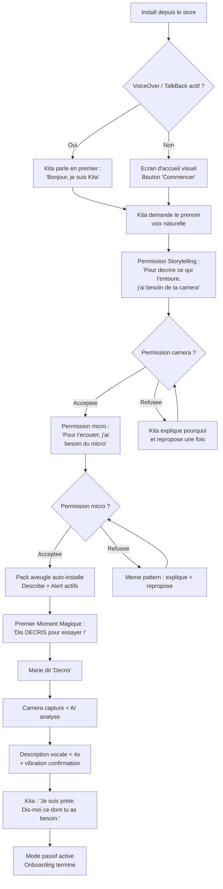
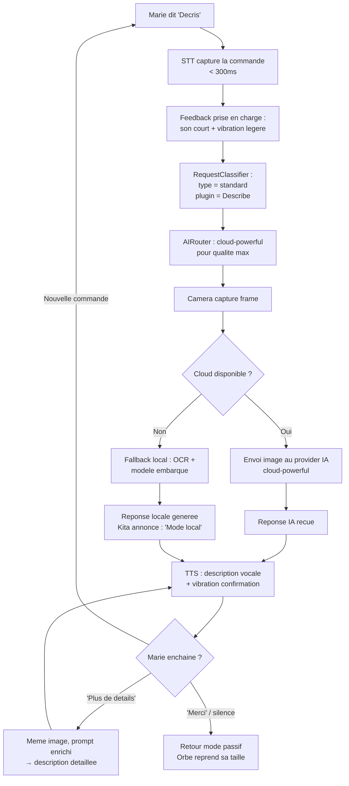
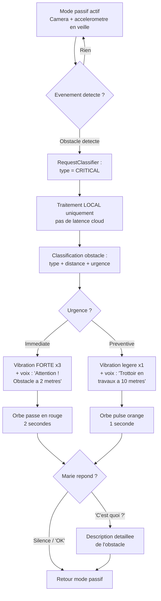
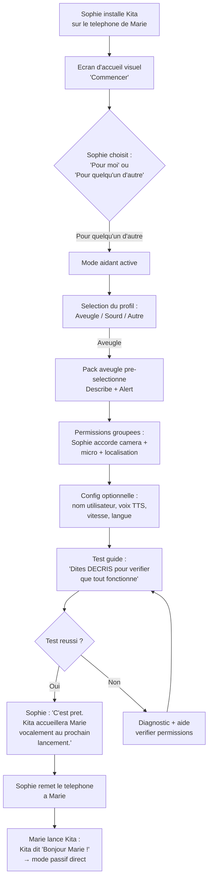
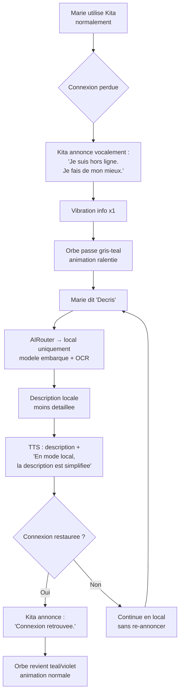

# UX Design Specification Kita

**Author:** Charles
**Date:** 2026-02-19

---

## Executive Summary

### Project Vision

Kita est un agent IA mobile voice-first dont l'UX est construite autour de trois principes : l'accessibilite comme mission (pas comme feature), l'interaction multi-sensorielle (voix + haptique + visuel), et le mode passif permanent avec activation a la demande. L'interface doit fonctionner sans ecran pour les utilisateurs aveugles, tout en restant riche visuellement pour les utilisateurs voyants.

### Target Users

**MVP :**
- **Marie (aveugle)** — Interaction 100% vocale, autonomie quotidienne, remplacement de 5 apps fragmentees. Profil technique : utilise VoiceOver, habituee aux gestes iOS/Android.
- **Sophie (aidante)** — Configure Kita pour un tiers, besoin d'un onboarding "j'installe pour quelqu'un d'autre" simple et rassurant.

**Post-MVP :**
- **Alex (developpeur)** — Cree des plugins, besoin d'un SDK clair et d'une interface plugin documentee.
- **Karim (sourd)** — Transcription multi-locuteurs, feedback visuel prioritaire.
- **Lea (autiste)** — Scripts sociaux, bulle sensorielle, interface rassurante.
- **Thomas (grand public)** — Assistant IA polyvalent, plugins a la carte.

### Key Design Challenges

1. **Onboarding zero-ecran** — Vocal-first en < 3 minutes, detection automatique VoiceOver/TalkBack, Premier Moment Magique en fin de flow
2. **Dualite voix/texte** — 100% des flows critiques navigables en vocal uniquement ET en texte
3. **Feedback multi-sensoriel** — Voix, haptique, visuel — chaque output doit fonctionner pour chaque profil d'accessibilite
4. **Mode passif permanent** — Communication d'etat sans ecran (voix + haptique), gestion des interruptions, alertes critiques qui percent tout
5. **Plugin viewport** — Les plugins doivent pouvoir afficher du contenu (overlay, plein ecran) sans casser l'accessibilite ni le flow principal

### Design Opportunities

1. **Premier Moment Magique** — L'experience "decris" → description vocale en 4 secondes est le hook produit. UX a soigner a l'extreme.
2. **Detection adaptative invisible** — L'app s'adapte au profil d'accessibilite AVANT toute interaction utilisateur. Innovation UX a fort potentiel de differentiation.
3. **Permission Storytelling** — Chaque permission expliquee dans son contexte d'usage. Modele de transparence reproductible.

## Core User Experience

### Defining Experience

L'interaction fondamentale de Kita est **commande vocale → reponse IA multi-sensorielle**. L'utilisateur parle, Kita repond par la voix, l'haptique et le visuel. Cette boucle est le coeur du produit — si elle est fluide, tout fonctionne. Le MVP la valide avec "decris" → description vocale < 5 secondes.

**Boucle core :**
1. Utilisateur parle une commande ("decris", "lis ca", "guide-moi", "aide")
2. Kita classifie (critical / urgent / standard / background)
3. Kita route (local ou cloud selon la classification)
4. Kita repond (voix + haptique + visuel adapte au profil)

### Platform Strategy

| Aspect | Decision |
|--------|----------|
| Plateforme | App mobile Flutter + modules natifs Swift/Kotlin |
| Input primaire | Voix (VoiceOver/TalkBack pour navigation, STT pour commandes) |
| Input secondaire | Texte + gestes tactiles |
| Output | Voix (TTS) + haptique (3 patterns) + visuel (pour voyants) |
| Offline | Fonctions critiques 100% locales (alertes, STT/TTS) |
| Capteurs | Camera, micro, GPS, accelerometre — les "sens" de l'agent |
| OS cibles | Android 12+ / iOS 16+ |

### Effortless Interactions

- **Parler a Kita = parler a une personne** — Commandes naturelles ("decris", "lis ca", "stop"), pas de syntaxe rigide
- **Onboarding sans lire** — Kita parle en premier, detecte VoiceOver/TalkBack, guide tout vocalement
- **Bascule passif/actif invisible** — Capteurs en veille, activation sur commande vocale ou mouvement detecte
- **Fallback transparent** — Cloud indisponible ? Kita bascule en local sans rupture perceptible (sauf degradation qualite annoncee)
- **Permissions naturelles** — "Pour decrire ce qui t'entoure, j'ai besoin de ta camera" au lieu d'un popup technique generique

### Critical Success Moments

| Moment | Experience | Impact |
|--------|-----------|--------|
| Premier Moment Magique | "Decris" → description du salon en 4s | Adoption — si ca rate, Marie desinstalle |
| Premiere alerte obstacle | Kita previent d'un trottoir en travaux | Confiance — Marie fait confiance a Kita pour sa securite |
| Premier fallback hors-ligne | OCR local prend le relais sans rupture | Fiabilite — Kita marche partout, toujours |
| "Forget everything" | Effacement 100% verifiable | Vie privee — Marie controle ses donnees |
| Premiere journee complete | Kita remplace Be My Eyes + Seeing AI + GPS | Fidelisation — Marie n'a plus besoin de ses anciennes apps |

### Experience Principles

1. **Voice-first, screen-optional** — L'ecran est un bonus, pas un pre-requis. 100% des flows critiques fonctionnent sans regarder le telephone.
2. **Zero-erreur sur les chemins critiques** — Les alertes de danger ne failent JAMAIS. Les requetes critiques retournent toujours une reponse.
3. **Transparence proactive** — Kita annonce ses etats, explique ses permissions, montre ce qu'il sait. Pas de boite noire.
4. **Adaptation invisible** — Kita detecte et s'adapte (accessibilite, connexion, batterie, mouvement) sans demander a l'utilisateur.

## Desired Emotional Response

### Primary Emotional Goals

Les 4 emotions fondamentales que Kita doit provoquer :

| Emotion | Description | Persona cle |
|---------|-------------|-------------|
| **Autonomie** | "Je peux le faire seul(e)" — L'utilisateur se sent capable, independant, libere de la dependance envers son entourage | Marie |
| **Confiance** | "Kita veille sur moi" — Certitude que les alertes critiques fonctionnent toujours, que Kita ne laisse pas tomber | Marie, Sophie |
| **Emerveillement** | "C'est magique" — Surprise positive lors du Premier Moment Magique et des reponses instantanees | Marie, Thomas |
| **Soulagement** | "Enfin une seule app" — Fin de la fragmentation, fin du jonglage entre 5-10 apps isolees | Marie, Sophie |

### Emotional Journey Mapping

| Etape | Emotion visee | Anti-emotion a eviter | Levier UX |
|-------|--------------|----------------------|-----------|
| **Decouverte** (store / bouche-a-oreille) | Curiosite + espoir | Scepticisme ("encore une app...") | Description store centree sur l'autonomie, pas sur la technologie |
| **Onboarding** | Surprise + securite | Confusion, frustration | Kita parle en premier, zero friction, detection auto VoiceOver |
| **Premier Moment Magique** | Emerveillement + "enfin!" | Deception (lenteur, mauvaise description) | "Decris" → reponse < 4s, voix naturelle, description precise |
| **Usage quotidien** | Autonomie + serenite | Intrusion, fatigue vocale | Mode passif silencieux, activation a la demande uniquement |
| **Alerte critique** | Confiance + gratitude | Peur, panique | Ton calme et factuel, haptique distincte, info actionnable |
| **Erreur / fallback** | Reassurance | Abandon, trahison | Fallback transparent, Kita annonce la degradation sans dramatiser |
| **Retour le lendemain** | Familiarite + progres | "Je dois tout recommencer" | Memoire qui reconnait, briefing matinal personnalise |

### Micro-Emotions

Les etats emotionnels subtils mais critiques pour le succes de Kita :

- **Confiance vs. Scepticisme** — CRITIQUE. Marie confie sa securite physique a Kita. La confiance se construit par la fiabilite (zero echec sur les alertes) et la transparence ("je suis hors ligne, je bascule en local").

- **Autonomie vs. Dependance** — CRITIQUE. Toute interaction ou Marie doit demander de l'aide a un tiers est un echec UX. Kita doit rendre chaque tache faisable en solo.

- **Serenite vs. Anxiete** — Le mode passif permanent ne doit JAMAIS provoquer d'inquietude ("est-ce que Kita ecoute tout ?"). Transparence proactive sur ce qui est capte et stocke.

- **Emerveillement vs. Satisfaction basique** — Le Premier Moment Magique doit depasser les attentes, pas juste les atteindre. La precision et la vitesse de la description doivent surprendre.

- **Appartenance vs. Isolation** — Kita ne doit pas donner le sentiment d'etre "un outil pour handicapes". C'est un assistant IA puissant que tout le monde utilise, avec des capacites d'accessibilite exceptionnelles.

- **Controle vs. Impuissance** — "Forget everything" et la transparence des donnees sont des gestes de controle. Marie decide ce que Kita sait et retient.

### Design Implications

Chaque emotion cible se traduit en choix UX concrets :

| Emotion | → | Decision UX |
|---------|---|-------------|
| Autonomie | → | 100% des flows critiques sans aide exterieure, commandes naturelles ("decris" pas "activer le module de description visuelle") |
| Confiance | → | Alertes critiques qui ne failent JAMAIS (fallback brut en dernier recours), ton vocal calme et factuel, haptique distincte par type d'alerte |
| Emerveillement | → | Temps de reponse < 4s pour le Premier Moment Magique, voix TTS naturelle (pas robotique), descriptions riches et contextuelles |
| Soulagement | → | Pack aveugle pre-installe automatiquement, zero configuration manuelle, onboarding en < 3 minutes |
| Serenite | → | Permission Storytelling (chaque permission expliquee), MemoryVault transparent, mode passif silencieux par defaut |
| Controle | → | "Forget everything" instantane et verifiable, "montre ce que tu sais sur moi" accessible a tout moment |
| Appartenance | → | Design universel (pas "app pour aveugles"), plugins a la carte, interface visuelle riche pour les voyants |

### Emotional Design Principles

1. **La fiabilite EST l'emotion** — Pour Marie, la confiance ne vient pas d'une belle animation mais d'une alerte qui fonctionne a chaque fois. La fiabilite technique est la premiere decision UX emotionnelle.

2. **Surprendre par la competence, pas par le spectacle** — Le "wow" de Kita vient de la precision et la vitesse de ses reponses, pas d'effets visuels. L'emerveillement doit fonctionner les yeux fermes.

3. **Le silence est un feedback** — En mode passif, l'absence de son/vibration signifie "tout va bien". Le silence de Kita est une emotion positive (serenite), pas un vide.

4. **Chaque friction est une dette de confiance** — Une permission mal expliquee, un fallback non annonce, un crash silencieux — chaque micro-friction erode la confiance. Tolerance zero sur les chemins critiques.

5. **L'autonomie se mesure en "appels evites"** — Si Marie n'a pas eu besoin d'appeler sa soeur aujourd'hui grace a Kita, l'emotion est un succes. KPI emotionnel concret.

## UX Pattern Analysis & Inspiration

### Inspiring Products Analysis

**1. Be My Eyes — L'assistance visuelle humaine**

| Aspect | Analyse |
|--------|---------|
| Probleme resolu | Connecter un aveugle a un voyant en temps reel pour decrire une situation |
| Force UX | Onboarding ultra-simple, 1 bouton, zero friction |
| Limite | Mono-usage, mono-profil. Si tu n'es pas aveugle, l'app ne sert a rien. |
| Lecon pour Kita | La simplicite du geste ("1 action") est le standard. Mais Kita ne doit PAS etre une app mono-profil — le core marche pour tous, les plugins specialisent. |

**2. Seeing AI (Microsoft) — L'IA visuelle**

| Aspect | Analyse |
|--------|---------|
| Probleme resolu | Description de scenes, lecture de texte, reconnaissance via camera |
| Force UX | Modes multiples, feedback audio immediat, fonctionne offline sur certains modes |
| Limite | App silo vision-only. Pas de contexte, pas de memoire, pas d'adaptation a d'autres profils. |
| Lecon pour Kita | La rapidite du feedback est le benchmark. Mais chez Kita, le feedback s'adapte au profil : audio pour Marie, visuel pour Karim, les deux pour Thomas. |

**3. Apple VoiceOver + Android TalkBack — Les couches d'accessibilite OS**

| Aspect | Analyse |
|--------|---------|
| Probleme resolu | Rendre un OS navigable sans ecran (VoiceOver) ou avec sous-titres (Live Caption) |
| Force UX | Coherence systemique, gestes universels, detection automatique |
| Limite | Necessite que chaque app soit correctement implementee. Couche passive, pas proactive. |
| Lecon pour Kita | Kita DETECTE la couche d'accessibilite active et s'adapte. VoiceOver actif ? → output voix. Live Caption actif ? → output texte. Aucune config manuelle. |

**4. Google Assistant / Siri — L'interaction vocale grand public**

| Aspect | Analyse |
|--------|---------|
| Probleme resolu | Interaction naturelle voix → action |
| Force UX | Modele mental universel "parler = agir", comprehension naturelle |
| Limite | Pas de personnalisation profonde, pas de memoire, pas de specialisation accessibilite |
| Lecon pour Kita | Le modele "parler = agir" est acquis. Mais Kita ajoute : input texte equivalent pour les sourds, input geste pour les non-verbaux. Chaque modalite d'input est un citoyen de premiere classe. |

### Transferable UX Patterns

**Patterns d'interaction multi-modale :**
- **Input multi-canal egal** — Voix, texte et geste sont des inputs equivalents. Aucun n'est "secondaire". Un sourd utilise le texte comme input primaire, un aveugle la voix — le core traite les deux identiquement.
- **Output adaptatif par profil** — Le meme evenement (alerte obstacle) produit : voix + haptique (profil aveugle), visuel + haptique (profil sourd), les trois (profil par defaut). C'est le profil actif qui decide, pas le plugin.
- **Feedback instantane < 500ms** — Chaque action recoit un retour dans la modalite du profil actif (son, vibration, visuel).

**Patterns de navigation :**
- **1 geste = 1 action** (Be My Eyes) — Simplicite du flow critique quel que soit le profil
- **Complement des couches OS** — Kita ne remplace pas VoiceOver/TalkBack/Live Caption, il se superpose

**Patterns de confiance :**
- **Transparence d'etat multi-modale** — Kita annonce son etat dans la modalite du profil (vocalement pour Marie, visuellement pour Karim)
- **Fallback gracieux** — Cloud indisponible → local, avec annonce dans la bonne modalite

### Anti-Patterns to Avoid

| Anti-pattern | Pourquoi c'est toxique | Alternative Kita |
|-------------|----------------------|-----------------|
| **App mono-profil** | Seeing AI = aveugles uniquement. Exclut tous les autres. | Core universel + plugins specialises. L'app marche pour tous, les plugins personnalisent. |
| **Output mono-modal** | Feedback uniquement audio OU uniquement visuel | Chaque output existe en 3 modalites (voix, haptique, visuel). Le profil active les bonnes. |
| **Input voix-only** | Un sourd ne peut pas utiliser "Hey Kita" | Voix, texte et geste sont des inputs egaux. Le plugin Transcription de Karim fonctionne en input texte. |
| **Onboarding fige** | Un seul flow d'onboarding pour tous les profils | Onboarding adaptatif : detection VoiceOver → flow vocal / detection rien → flow standard / choix du pack plugin |
| **Silence pendant le traitement** | Anxiogene quel que soit le profil | Indicateur de traitement dans la modalite du profil (audio, haptique ou visuel) |
| **Permissions en cascade** | 5 popups = abandon pour tout le monde | Permission Storytelling contextuel, adapte a la modalite du profil |
| **Confirmations modales bloquantes** | Un popup "Etes-vous sur ?" casse le flow vocal ET le flow visuel | Confirmations non-bloquantes dans la modalite du profil |

### Design Inspiration Strategy

**Adopter :**
- **Simplicite radicale du geste critique** — 1 mot/geste = 1 action, quel que soit le profil
- **Feedback instantane** — < 500ms dans la modalite adaptee au profil
- **Detection et adaptation automatique** — VoiceOver/TalkBack/Live Caption detectes → profil adapte sans config

**Adapter :**
- **Wake word** → Activation vocale OU texte OU mouvement selon le profil. Multi-input de premiere classe.
- **Modes camera** (Seeing AI) → Plugins unifies avec routing intelligent. "Decris" (voix) = bouton "Decrire" (texte/UI) = meme plugin, meme resultat, output adapte au profil.
- **Rotor VoiceOver** → Navigation contextuelle dans la modalite du profil. Voix ("mes options ?") ou UI (menu contextuel) ou geste.

**Eviter :**
- **Design mono-profil** — Kita n'est PAS "une app pour aveugles". C'est un agent IA universel avec des capacites d'accessibilite modulaires.
- **Hierarchie de modalites** — Aucune modalite (voix, texte, geste) n'est superieure aux autres. Toutes sont des citoyens de premiere classe.
- **Plugins qui imposent une modalite** — Un plugin "Describe" doit renvoyer son resultat en voix ET en texte. C'est le profil qui choisit l'output, pas le plugin.

## Design System Foundation

### Design System Choice

**Mix (utility-first) + couche multi-modale Kita custom**, construits sur les primitives Flutter.

Mix est un systeme de styling Flutter inspire de Tailwind CSS qui permet de composer des styles visuels par combinaison, extension et modification — sans les contraintes structurelles de Material Design. Les composants visuels sont libres, l'identite est unique, et la verbosite est reduite par rapport au full custom.

La couche multi-modale Kita (voix + haptique + adaptation par profil) est construite custom par-dessus.

### Rationale for Selection

| Critere | Pourquoi Mix + custom |
|---------|----------------------|
| **Effet wow** | Liberte visuelle totale — pas de "look Material" generique. Kita a sa propre identite. |
| **Effort** | Moins verbeux que le full custom grace au utility-first. Pas de widgets a construire from scratch. |
| **Multi-modal** | La composition de styles Mix s'etend naturellement aux tokens vocaux et haptiques. |
| **Pas de plafond** | Aucune contrainte structurelle — les composants font ce que Kita a besoin, pas ce que Material impose. |
| **Flutter-native** | Mix est concu pour Flutter, pas porte d'un ecosysteme web. |
| **Evolution** | Remix UI (design system officiel base sur Mix) est en developpement — ecosysteme grandissant. |

### Implementation Approach

```
┌─────────────────────────────────────────────┐
│          Kita Design System                  │
│  ┌──────────────────────────────────────┐    │
│  │  KitaMultiModal Layer (custom)      │    │
│  │  VoiceFeedback · HapticFeedback     │    │
│  │  ProfileAdapter · MultiModalTokens  │    │
│  ├──────────────────────────────────────┤    │
│  │  KitaUI Components (Mix-based)      │    │
│  │  Styles composes · Variants         │    │
│  │  Animations · Identite visuelle     │    │
│  ├──────────────────────────────────────┤    │
│  │  Mix Framework                      │    │
│  │  Utility-first · Style composition  │    │
│  │  Modifiers · Extensions             │    │
│  └──────────────────────────────────────┘    │
├─────────────────────────────────────────────┤
│  Flutter SDK (Semantics API, Widgets)        │
└─────────────────────────────────────────────┘
```

**Couche Mix (visuel) :**
- Styles composes par utility : couleurs, typographie, espacement, formes, ombres
- Variants par contexte (actif, inactif, erreur, succes)
- Animations et transitions custom
- Design tokens visuels unifie

**Couche Kita (multi-modal) :**
- **VoiceFeedbackManager** — Annonces TTS, ton, priorite, file d'attente
- **HapticFeedbackManager** — 3 patterns (confirmation, alerte, erreur), intensite adaptative
- **ProfileAdapter** — Detecte le profil actif, route chaque output vers les bonnes modalites
- **MultiModalTokens** — Tokens unifies voix + haptique + visuel

### Customization Strategy

**Design Tokens — systeme unifie 3 couches :**

| Couche | Gere par | Tokens |
|--------|----------|--------|
| **Visuel** | Mix | Couleurs, typo, espacement, formes, elevation, animations |
| **Vocal** | Kita custom | Vitesse TTS, ton, priorite, langue, file d'attente |
| **Haptique** | Kita custom | Pattern, duree, intensite, repetition |

**Composants MVP (Mix-based) :**
- `KitaScaffold` — Layout principal, zone plugin, status multi-modal
- `KitaButton` — Feedback tri-modal integre, variants par contexte
- `KitaCard` — Conteneur d'info, lecture vocale auto pour profil aveugle
- `KitaDialog` — Non-bloquant, vocal-first, pas de popup modal
- `KitaInput` — Texte + dictee vocale unifies
- `KitaStatusIndicator` — Etat Kita en 3 modalites simultanees

**Adaptation par profil :**

| Profil | Visuel | Vocal | Haptique |
|--------|--------|-------|----------|
| Aveugle (Marie) | Minimal (VoiceOver gere) | Primaire | Fort |
| Sourd (Karim) | Primaire — effet wow ici | Desactive | Fort |
| Standard (Thomas) | Complet — effet wow ici | Secondaire | Moyen |
| Aidant (Sophie) | Complet + dashboard | Desactive | Leger |

## 2. Core User Experience (Deep Dive)

### 2.1 Defining Experience

**La phrase signature de Kita :**

> **"Dis ce que tu veux, Kita le fait — dans ta modalite."**

L'interaction fondamentale : l'utilisateur exprime un besoin (voix, texte ou geste) → Kita comprend, route vers le bon plugin, et repond dans la modalite adaptee au profil (voix, visuel, haptique ou combinaison).

**Le moment signature par profil :**

| Profil | Moment signature | Ce que l'utilisateur dit a un ami |
|--------|-----------------|----------------------------------|
| Marie (aveugle) | "Decris" → description vocale du salon en 4s | "Je lui dis 'decris' et elle me raconte ce qu'il y a devant moi" |
| Karim (sourd) | Reunion → transcription multi-locuteurs en temps reel | "Je vois qui parle et ce qu'il dit, en direct sur mon tel" |
| Thomas (grand public) | Commande naturelle → action instantanee | "C'est comme un assistant mais qui me connait vraiment" |

**Si on reussit UNE chose :** la boucle `input naturel → reponse < 5s dans la bonne modalite`. Tout le reste en decoule.

### 2.2 User Mental Model

**Comment les utilisateurs resolvent le probleme aujourd'hui :**

| Profil | Solution actuelle | Frustration | Modele mental |
|--------|------------------|-------------|---------------|
| Marie | 5+ apps separees (Be My Eyes, Seeing AI, GPS, OCR, assistant) | Jongler entre apps, chaque app = 1 truc | "J'ai besoin d'UNE personne qui m'aide pour tout" |
| Karim | Apps de transcription isolees + sous-titres auto | Pas de contexte, transcription sans identification du locuteur | "Je veux comprendre les conversations autour de moi" |
| Thomas | Siri/Google Assistant | Pas de memoire, pas de personnalisation profonde | "Je veux un assistant qui me connait" |

**Le modele mental cible de Kita :** un **compagnon intelligent** — pas un outil, pas un menu, pas une app. Un etre qui comprend, repond et s'adapte. Le modele est la conversation naturelle, pas l'interaction avec une machine.

**Ou les utilisateurs risquent d'etre confus :**
- "Qu'est-ce que Kita peut faire ?" → Decouverte des capacites (plugins). Solution : Kita propose proactivement ("Tu veux que je decrive ?")
- "Est-ce que Kita m'ecoute tout le temps ?" → Vie privee du mode passif. Solution : Transparence proactive, "montre ce que tu sais"
- "Pourquoi la reponse est differente ?" → Fallback cloud/local. Solution : Kita annonce le mode actif

### 2.3 Success Criteria

| Critere | Seuil | Mesure |
|---------|-------|--------|
| **Temps de reponse** | < 5s pour une reponse complete, < 500ms pour un feedback de prise en charge | Chrono du input a la premiere syllabe/vibration/pixel |
| **Precision** | La reponse correspond au besoin sans reformulation | Taux de reformulation < 10% |
| **Bonne modalite** | La reponse arrive dans la modalite du profil, pas dans une autre | 0 output visuel-only pour profil aveugle |
| **Zero config** | L'utilisateur n'a rien configure pour que ca marche | Nombre d'etapes entre install et Premier Moment Magique |
| **Fiabilite** | Ca marche a chaque fois, meme hors ligne | Taux de reponse 100% sur chemins critiques (degrade accepte) |
| **Naturel** | L'utilisateur parle/ecrit comme a un humain | Pas de syntaxe apprise, pas de mot-cle obligatoire |

### 2.4 Novel UX Patterns

**Patterns etablis reutilises :**
- Commande vocale → action (Siri/Google) — modele mental acquis
- Feedback sonore immediat (Seeing AI) — attente existante
- Onboarding conversationnel — pattern connu (chatbots)

**Patterns nouveaux a inventer :**

| Innovation Kita | Metaphore familiere | Education necessaire |
|----------------|---------------------|---------------------|
| **Output multi-modal adaptatif** — meme action, feedback different selon le profil | Comme un interprete qui s'adapte a la langue | Minimale — l'utilisateur ne voit que SA modalite |
| **Mode passif intelligent** — capteurs en veille, activation contextuelle | Comme un ami qui te previent d'un danger sans que tu demandes | Moyenne — expliquer le mode passif sans creer d'inquietude vie privee |
| **Plugin routing transparent** — l'utilisateur ne choisit pas le plugin, Kita route | Comme un concierge d'hotel — tu dis ce que tu veux, il sait qui appeler | Minimale — invisible par design |
| **Profil adaptatif auto** — detection VoiceOver/TalkBack → profil active | Comme un site responsive qui s'adapte a l'ecran | Zero — totalement invisible |

### 2.5 Experience Mechanics

**Flow detaille de l'interaction core :**

**1. Initiation :**
- **Voix :** L'utilisateur dit une commande naturelle ("decris", "lis ca", "c'est qui ?", "aide")
- **Texte :** L'utilisateur tape dans le champ de saisie
- **Geste :** Double-tap arriere du telephone, secouer, ou bouton physique
- **Automatique :** Mode passif detecte un evenement (obstacle, mouvement brusque) → Kita initie

**2. Classification + Routing (invisible) :**
- RequestClassifier analyse : critical / urgent / standard / background
- AIRouter choisit : local (< 50ms) ou cloud-fast ou cloud-powerful
- PluginManager identifie le plugin cible (Describe, Alert, Transcribe...)

**3. Feedback intermediaire (< 500ms) :**
- **Profil aveugle :** Son court de prise en charge + vibration legere
- **Profil sourd :** Animation visuelle de chargement + vibration legere
- **Profil standard :** Son + animation + vibration

**4. Reponse (< 5s) :**
- **Profil aveugle :** Voix TTS naturelle + vibration de confirmation
- **Profil sourd :** Texte affiche + vibration de confirmation
- **Profil standard :** Voix + texte + visuel + vibration

**5. Post-reponse :**
- Kita retourne en mode passif
- Interaction sauvegardee en memoire episodique (si pertinent)
- L'utilisateur peut enchainer ("plus de details", "repete", "merci")

**En cas d'erreur :**
- Fallback chain : cloud-powerful → cloud-fast → local → reponse brute
- Kita annonce la degradation : "Je suis hors ligne, je fais de mon mieux"
- Jamais de silence. Jamais de crash silencieux. Toujours une reponse.

## Visual Design Foundation

### Color System

**Philosophie couleur :** Confiance (teal) + intelligence (violet) — une identite distinctive qui se demarque des apps d'accessibilite generiques en bleu/vert.

**Palette :**

| Role | Couleur | Hex | Rationale |
|------|---------|-----|-----------|
| **Primary** | Teal chaud | `#0D9488` | Confiance + calme + technologie accessible |
| **Primary variant** | Teal profond | `#0F766E` | Etats actifs, hover, focus |
| **Accent** | Violet electrique | `#8B5CF6` | Intelligence, innovation, signature visuelle memorable. "L'app violette." |
| **Accent variant** | Violet profond | `#7C3AED` | Etats actifs |
| **Background** | Gris charbon | `#1A1A2E` | Mode dark par defaut pour tous les profils |
| **Surface** | Gris nuit | `#16213E` | Cards, conteneurs, elevation |
| **On-background** | Blanc doux | `#F8FAFC` | Texte principal — pas blanc pur (moins agressif) |
| **On-surface** | Gris clair | `#E2E8F0` | Texte secondaire (contraste renforce) |

**Couleurs semantiques :**

| Semantique | Couleur | Hex | Usage |
|-----------|---------|-----|-------|
| **Success** | Vert emeraude | `#10B981` | Action reussie, confirmation |
| **Warning** | Orange chaud | `#F97316` | Attention, batterie faible |
| **Error** | Rouge corail | `#EF4444` | Erreur, alerte critique |
| **Info** | Bleu ciel | `#3B82F6` | Information, aide |

**Mode clair :** Disponible en option — fond `#F8FAFC`, surfaces `#F1F5F9`, texte `#1E293B`. Memes primary/accent.

**Accessibilite couleur :**
- Ratio de contraste minimum **4.5:1** (WCAG AA) pour tout texte
- Ratio **7:1** (WCAG AAA) pour le texte principal sur background
- Texte secondaire `#E2E8F0` sur `#1A1A2E` = ratio ~12:1 (verifie)
- Jamais d'information transmise uniquement par la couleur — toujours couleur + icone + texte
- Palette testee pour deuteranopie, protanopie, tritanopie

### Typography System

**Duo typographique contrast — identite forte :**

**Titres : Space Grotesk** (geometrique, bold, futuriste)
- Open-source, caractere distinctif
- Communique l'innovation et la modernite
- Utilise pour display, headings, boutons

**Corps : Nunito** (humaniste, douce, chaleureuse)
- Open-source, excellente lisibilite ecran
- Communique la chaleur et l'accessibilite
- Utilise pour body, captions, labels

**Monospace : JetBrains Mono** (technique)
- Logs, debug, plugin dev uniquement

**Echelle typographique (base 8px) :**

| Token | Taille | Font | Poids | Usage |
|-------|--------|------|-------|-------|
| `display` | 32px | Space Grotesk | Bold (700) | Titres principaux, ecran d'accueil |
| `heading1` | 24px | Space Grotesk | SemiBold (600) | Titres de section |
| `heading2` | 20px | Space Grotesk | SemiBold (600) | Sous-titres |
| `body` | 16px | Nunito | Regular (400) | Texte courant — minimum absolu |
| `bodyLarge` | 18px | Nunito | Regular (400) | Texte principal pour profils basse vision |
| `caption` | 14px | Nunito | Regular (400) | Labels, metadata |
| `button` | 16px | Space Grotesk | Medium (500) | Texte des boutons |

**Regles :**
- Taille minimum **14px** — jamais plus petit
- Line-height : 1.5x la taille du texte
- Taille ajustable par l'utilisateur (facteur 0.8x a 2.0x)
- Pas d'italique pour le contenu critique

### Spacing & Layout Foundation

**Grille de base : 8px**

| Token | Valeur | Usage |
|-------|--------|-------|
| `xs` | 4px | Micro-espacement (icone-texte) |
| `sm` | 8px | Espacement interne compact |
| `md` | 16px | Espacement standard |
| `lg` | 24px | Espacement entre sections |
| `xl` | 32px | Espacement entre blocs majeurs |
| `2xl` | 48px | Marges de page |

**Touch targets :**
- Taille minimum : **48x48px** (WCAG) — non negociable
- Taille recommandee : **56x56px** pour les actions critiques
- Espacement entre cibles tactiles : minimum **8px**

**Layout principles :**
- **Aere, pas dense** — L'espace vide est un choix de design
- **Single-column mobile** — Flow vertical lineaire, scannable
- **Zone de pouce** — Actions critiques dans le tiers inferieur de l'ecran
- **Plugin viewport** — Zone centrale reservee aux plugins, taille adaptative

### Motion Design Principles

**Le mouvement est l'ame du visuel** — pour Karim (sourd), les animations remplacent le rythme sonore. Pour Lea (autiste, post-MVP), la previsibilite visuelle est une necessite.

**Principes :**

1. **Transitions d'etat lisibles** — Chaque changement d'etat (passif → actif → traitement → reponse → retour passif) a une animation dediee, toujours la meme. L'utilisateur reconnait l'etat par le mouvement.

2. **Indicateur visuel de source** — En transcription, chaque locuteur a un indicateur anime distinct (couleur + position + micro-animation). Karim sait QUI parle par le visuel.

3. **Zero surprise** — Pas de pop-in inattendu, pas de flash, pas de mouvement non initie par l'utilisateur ou un evenement annonce. Chaque animation est previsible.

4. **`prefers-reduced-motion`** — Toutes les animations desactivables. En mode reduit : transitions instantanees, pas de parallax, pas de bounce.

5. **Durees coherentes** — Micro-interactions : 150ms. Transitions de page : 300ms. Animations d'etat : 500ms. Jamais plus de 500ms pour une animation fonctionnelle.

### Implementation Notes

**Mix framework + plan B :**
- Base sur Mix pour le styling utility-first
- Si Mix n'est pas maintenu a long terme : migration vers `ThemeExtension` natif Flutter (les tokens restent identiques, seule la couche d'implementation change)

**HapticAdapter par plateforme :**
- iOS : `UIImpactFeedbackGenerator` (presets light/medium/heavy/rigid/soft)
- Android : `VibrationEffect` (patterns custom)
- Les tokens haptiques Kita mappent vers l'implementation native de chaque OS

### Accessibility Considerations

| Critere | Standard | Implementation Kita |
|---------|----------|-------------------|
| **Contraste texte principal** | WCAG AAA 7:1 | `#F8FAFC` sur `#1A1A2E` = 13.5:1 |
| **Contraste texte secondaire** | WCAG AAA 7:1 | `#E2E8F0` sur `#1A1A2E` = ~12:1 |
| **Contraste composants** | WCAG AA 3:1 | Bordures et icones testes sur les deux modes |
| **Taille tactile** | 48x48px minimum | 56x56px pour actions critiques |
| **Taille texte** | Minimum 14px | Ajustable 0.8x-2.0x |
| **Animation** | `prefers-reduced-motion` | Toutes les animations desactivables |
| **Daltonisme** | Info jamais par couleur seule | Couleur + icone + texte systematiquement |
| **Focus visible** | Outline 3px | Anneau violet `#8B5CF6` sur fond sombre |

## Design Direction Decision

### Design Directions Explored

4 directions explorees :
1. **Ambient Companion** — Zen, epure, orbe animee, ecran quasi-vide
2. **Conversation Flow** — Chat classique, bulles, fil historique
3. **Command Center** — Dashboard info-dense, status de tout
4. **Living Aura** — Hybride orbe animee + contenu adaptatif par plugin

### Chosen Direction

**Living Aura** — Shell avec orbe animee (teal/violet) en mode passif, contenu enrichi en mode actif. Le viewport central est controle par le plugin actif.

**Architecture shell + plugin viewport :**

```
┌──────────────────────────────┐
│  Shell Kita (Living Aura)    │
│  ┌────────────────────────┐  │
│  │  Header + Orbe/Status  │  │  ← Constant
│  ├────────────────────────┤  │
│  │                        │  │
│  │   Plugin Viewport      │  │  ← Le plugin decide
│  │   (contenu adaptatif)  │  │     de son layout
│  │                        │  │
│  ├────────────────────────┤  │
│  │  Input (voix/texte)    │  │  ← Constant
│  └────────────────────────┘  │
└──────────────────────────────┘
```

**Viewport par plugin :**

| Plugin | Son viewport | Layout |
|--------|-------------|--------|
| **Describe** | Photo + description texte/vocale | Image en haut, texte en dessous |
| **Alert** | Alerte plein ecran, haptique forte | Fond rouge/orange, message gros, 1 action |
| **Transcribe** | Fil de transcription multi-locuteurs | Bulles colorees par locuteur, scroll auto |
| **Aucun (passif)** | Orbe animee + "Tout va bien" | Living Aura mode passif |
| **Conversation** | Echange libre avec Kita | Bulles type chat |

### Design Rationale

| Critere | Pourquoi Living Aura |
|---------|---------------------|
| **Effet wow** | L'orbe animee teal/violet est la signature visuelle de Kita — unique, memorable |
| **Adaptabilite** | Le shell est fixe, le viewport est flexible — chaque plugin a son layout |
| **Mode passif** | L'ecran passif est beau et minimal — l'orbe montre l'etat sans texte |
| **Mode actif** | Le contenu se deploie naturellement sous l'orbe reduite |
| **Multi-profil** | Karim voit le texte dans le viewport, Marie n'utilise pas l'ecran, Thomas a les deux |

### Implementation Approach

**Shell Living Aura (constant) :**
- `KitaShell` — Scaffold global avec header, orbe, viewport, input
- `KitaOrb` — Widget anime (teal/violet) avec etats : passif (ondulation lente), actif (pulsation), traitement (flux), erreur (rouge), hors-ligne (gris)
- `KitaInput` — Zone input voix/texte, toujours en bas

**Plugin Viewport (variable) :**
- `PluginViewport` — Zone centrale que le plugin remplit avec son propre layout
- Chaque plugin fournit un `Widget buildViewport(BuildContext)` dans son interface
- Le viewport a des contraintes (pas d'acces au header/input, sandbox visuel)
- Fallback : si le plugin n'a pas de viewport, affichage texte brut de la reponse

**Transitions :**
- Passif → Actif : orbe se reduit en haut, viewport slide du bas (300ms)
- Actif → Reponse : viewport se remplit, orbe pulse en confirmation (150ms)
- Reponse → Passif : viewport fade out, orbe reprend sa taille (500ms)

## User Journey Flows

### Journey 1 : Onboarding Marie (aveugle)

**Objectif :** De l'installation au Premier Moment Magique en < 3 minutes, sans ecran.



**Points critiques :**
- Detection VoiceOver/TalkBack AVANT la premiere interaction
- Kita parle en premier — Marie n'a rien a chercher
- Permission Storytelling : chaque permission expliquee, max 2 tentatives
- Premier Moment Magique a la fin = hook emotionnel

### Journey 2 : "Decris" (interaction core)

**Objectif :** Commande vocale → description vocale < 5s, avec feedback intermediaire < 500ms.



**Points critiques :**
- Feedback intermediaire < 500ms (son + vibration) — jamais de silence
- Fallback transparent avec annonce du mode
- Enchainement naturel ("plus de details", "repete", "merci")

### Journey 3 : Alerte obstacle (mode passif)

**Objectif :** Detection proactive → alerte vocale + haptique en < 2s, sans commande de Marie.



**Points critiques :**
- Traitement 100% LOCAL — zero latence cloud pour les alertes critiques
- Vibration differenciee : forte x3 (immediat) vs legere x1 (preventif)
- Voix calme et factuelle — pas de panique
- Marie peut demander des details ou ignorer

### Journey 4 : Sophie configure pour Marie

**Objectif :** Sophie installe et configure Kita pour Marie en < 5 minutes.



**Points critiques :**
- Flow "pour quelqu'un d'autre" — Sophie ne doit JAMAIS se sentir perdue
- Permissions groupees (pas une par une pour Sophie)
- Test obligatoire avant validation
- Premier lancement de Marie = accueil personnalise, pas re-onboarding

### Journey 5 : Fallback hors-ligne

**Objectif :** Perte de connexion → bascule locale transparente avec annonce.



**Points critiques :**
- Annonce UNE FOIS de la perte de connexion, pas a chaque commande
- Mode degrade fonctionne — la reponse est moins bonne, pas absente
- Annonce du retour de connexion
- Alertes critiques restent 100% fonctionnelles (deja locales)

### Journey Patterns

**Patterns reutilisables identifies :**

| Pattern | Description | Utilise dans |
|---------|-------------|-------------|
| **Feedback immediat** | Son + vibration < 500ms a chaque input | Tous les journeys |
| **Annonce d'etat** | Kita annonce vocalement les transitions d'etat | Fallback, alerte, onboarding |
| **Enchainement naturel** | L'utilisateur peut enchainer sans re-initier | Decris, alerte |
| **Fallback gracieux** | Degradation transparente avec annonce unique | Fallback, decris |
| **Permission Storytelling** | Permission contextuelle, expliquee, max 2 tentatives | Onboarding |
| **Test avant validation** | Verification fonctionnelle avant de conclure un setup | Onboarding Sophie |

### Flow Optimization Principles

1. **Minimum de steps vers la valeur** — Premier Moment Magique en < 3 min (onboarding), reponse en < 5s (decris)
2. **Jamais de cul-de-sac** — Chaque erreur a un chemin de recovery
3. **Annonce unique** — Les changements d'etat sont annonces UNE fois, pas repetes en boucle
4. **Le silence = retour passif** — Si Marie ne dit rien pendant 5s apres une reponse, Kita retourne en passif sans demander confirmation

## Component Strategy

### Design System Components

**Mix fournit le styling, pas les composants.** Composition de styles, variants, modifiers, responsive utilities. Les composants sont construits sur les primitives Flutter et styles avec Mix.

**Flutter SDK fournit :** `Semantics` (a11y), `AnimatedBuilder`/`CustomPainter` (orbe), `MediaQuery` (responsive), Platform channels (bridge natif Swift/Kotlin pour haptics, camera, STT/TTS).

### Custom Components

#### KitaOrb

| Spec | Detail |
|------|--------|
| **Purpose** | Signature visuelle de Kita. Represente son etat en temps reel. |
| **Anatomy** | Sphere animee gradient teal/violet, particules, ondulations |
| **States** | `passive` (ondulation lente), `listening` (pulsation), `processing` (flux accelere), `responding` (expansion + confirmation), `error` (rouge pulse), `offline` (gris-teal, ralenti) |
| **Tailles** | `large` (mode passif, centre ecran), `small` (mode actif, reduit en haut) |
| **Accessibilite** | `Semantics(label: "Kita est [etat]")` — VoiceOver lit l'etat |
| **Animation** | `CustomPainter` + `AnimationController`, 60fps, `prefers-reduced-motion` respecte |

#### KitaShell

| Spec | Detail |
|------|--------|
| **Purpose** | Scaffold principal de l'app — layout constant avec 3 zones |
| **Anatomy** | Header (status) + Orbe/Viewport (contenu central) + Input (voix/texte) |
| **Comportement** | En mode passif : orbe large. En mode actif : orbe small + viewport deploye |
| **Transition** | Orbe shrink 300ms → viewport slide-up 300ms |
| **Accessibilite** | Focus order : Input → Viewport → Header. Live region sur le viewport. |

#### KitaInput

| Spec | Detail |
|------|--------|
| **Purpose** | Zone d'input unifiee voix + texte, toujours en bas |
| **Anatomy** | Champ texte + bouton micro + indicateur d'ecoute |
| **States** | `idle` (placeholder), `listening` (micro actif, onde visuelle), `typing` (clavier ouvert), `disabled` (pendant traitement) |
| **Accessibilite** | Label "Parle ou ecris a Kita", focus auto au lancement, compatible VoiceOver dictee |
| **Touch target** | 56x56px pour le bouton micro |

#### KitaAlert

| Spec | Detail |
|------|--------|
| **Purpose** | Alerte critique plein viewport — obstacle, danger |
| **Anatomy** | Fond colore (rouge/orange), icone grande, message gros texte, 1 bouton action |
| **States** | `immediate` (rouge, vibration x3), `preventive` (orange, vibration x1) |
| **Comportement** | Prend tout le viewport, disparait apres 5s ou "OK" vocal |
| **Accessibilite** | `Semantics(liveRegion: true)`, annonce vocale automatique, vibration haptique |
| **Multi-modal** | Voix TTS + vibration + visuel simultanes |

#### KitaPermissionCard

| Spec | Detail |
|------|--------|
| **Purpose** | Permission Storytelling — explique pourquoi une permission est necessaire |
| **Anatomy** | Icone contexte + explication en langage naturel + boutons Accepter/Refuser |
| **Exemple** | Icone camera + "Pour decrire ce qui t'entoure, j'ai besoin de ta camera" |
| **States** | `asking`, `granted`, `denied`, `re-asking` (max 1 fois) |
| **Accessibilite** | Texte lu par VoiceOver, boutons 56x56px, focus auto sur Accepter |

#### KitaStatusIndicator

| Spec | Detail |
|------|--------|
| **Purpose** | Affiche l'etat de Kita dans le header (connexion, batterie, mode) |
| **Anatomy** | Icones compactes avec tooltips, couleur semantique |
| **States** | `online` (teal), `offline` (gris), `degraded` (orange), `error` (rouge) |
| **Multi-modal** | Visuel pour voyants + annonce vocale lors des changements d'etat |
| **Accessibilite** | `Semantics` sur chaque indicateur, pas d'info par couleur seule |

#### PluginViewport

| Spec | Detail |
|------|--------|
| **Purpose** | Zone sandbox ou le plugin affiche son contenu |
| **Anatomy** | Container contraint (pas d'acces header/input), scrollable |
| **Comportement** | Le plugin injecte son Widget. Fallback : texte brut si pas de viewport custom. |
| **Constraints** | Pas de navigation hors viewport, pas de modification du shell, pas d'overlay |
| **Accessibilite** | Live region, contenu accessible, focus trap dans le viewport |

#### KitaFeedbackBubble

| Spec | Detail |
|------|--------|
| **Purpose** | Bulle de reponse dans le viewport (texte, image, carte) |
| **Anatomy** | Avatar Kita + contenu + timestamp |
| **Variants** | `text` (reponse simple), `image` (photo + description), `rich` (carte, lien, action) |
| **Accessibilite** | Contenu lu par VoiceOver, images avec alt-text genere par l'IA |

#### TranscriptionBubble (plugin Transcribe)

| Spec | Detail |
|------|--------|
| **Purpose** | Bulle de transcription attribuee a un locuteur |
| **Anatomy** | Indicateur couleur locuteur + nom + texte + timestamp |
| **Comportement** | Scroll auto, nouveau locuteur = nouvelle couleur, animation d'apparition |
| **Accessibilite** | Lecture sequentielle VoiceOver, identification du locuteur dans le label |

### Component Implementation Strategy

- Chaque composant est un Widget Flutter standalone, style avec Mix
- Chaque composant integre nativement les 3 modalites (visuel + vocal + haptique) via `ProfileAdapter`
- Les tokens multi-modaux sont injectes via `KitaTheme` (inherited widget)
- Les composants sont testes unitairement avec `flutter_test` + tests d'accessibilite avec `Semantics` tester

### Implementation Roadmap

**Phase 1 — MVP Core (Sprint 1-2) :**

| Composant | Criticite | Journey |
|-----------|----------|---------|
| `KitaShell` | Bloquant | Tous |
| `KitaOrb` | Bloquant | Tous (signature visuelle) |
| `KitaInput` | Bloquant | Tous (input voix/texte) |
| `KitaAlert` | Bloquant | Alerte obstacle |
| `KitaPermissionCard` | Bloquant | Onboarding |
| `PluginViewport` | Bloquant | Describe, Alert |
| `KitaFeedbackBubble` | Bloquant | Describe (affichage reponse) |

**Phase 2 — Enrichissement (Sprint 3-4) :**

| Composant | Criticite | Journey |
|-----------|----------|---------|
| `KitaStatusIndicator` | Important | Fallback, etat general |
| `TranscriptionBubble` | Important | Transcribe (post-MVP) |
| `KitaDialog` | Important | Settings, confirmation |
| `KitaCard` | Moyen | Liste plugins, infos |

**Phase 3 — Dashboard Sophie (Sprint 5+) :**

| Composant | Criticite | Journey |
|-----------|----------|---------|
| `KitaConfigPanel` | Moyen | Sophie configure |
| `KitaPluginManager` | Moyen | Gestion plugins |
| `KitaProfileSelector` | Moyen | Choix de profil |

## UX Consistency Patterns

### Multi-Modal Feedback Patterns

Chaque feedback existe en 3 modalites. Le `ProfileAdapter` active la bonne combinaison.

| Situation | Visuel | Vocal | Haptique |
|-----------|--------|-------|----------|
| **Prise en charge** | Orbe pulse brief | Son court "blip" | Vibration legere x1 |
| **Traitement en cours** | Orbe flux accelere | Silence | — |
| **Succes** | Orbe expansion verte brief | TTS reponse naturelle | Vibration confirmation x1 |
| **Erreur recuperable** | Flash orange viewport | "Je n'ai pas compris, repete ?" | Vibration double x2 |
| **Erreur critique** | Fond rouge viewport | "Erreur. [Explication]." | Vibration forte x3 |
| **Warning** | Icone orange header | "Attention : [info]" | Vibration legere x1 |
| **Info** | Texte dans viewport | "[Information]" | — |
| **Changement d'etat** | Orbe change de couleur/rythme | Annonce vocale unique | Vibration info x1 |
| **Retour passif** | Orbe reprend taille large | Silence (tout va bien) | — |

### Command Patterns

Coherence totale entre les 3 inputs :

| Action | Voix | Texte | Geste |
|--------|------|-------|-------|
| **Activer Kita** | "Kita" ou commande directe | Tap sur KitaInput | Double-tap arriere telephone |
| **Commande plugin** | "Decris", "Lis", "Alerte" | Taper la commande | — |
| **Annuler** | "Stop" ou "Annule" | Bouton X | Secouer le telephone |
| **Repeter** | "Repete" | Bouton replay | — |
| **Detailler** | "Plus de details" | Tap sur la reponse | — |
| **Retour passif** | "Merci" ou silence 5s | Swipe down | — |
| **Aide** | "Aide" ou "Qu'est-ce que tu peux faire ?" | Bouton ? | — |
| **Forget** | "Oublie tout" | Settings → Forget | — |

Regle : toute action faisable en voix DOIT etre faisable en texte/geste.

### State Transition Patterns

Les 5 etats de Kita et leurs transitions :

| Transition | Duree | Visuel | Audio | Haptique |
|------------|-------|--------|-------|----------|
| Passif → Actif | 300ms | Orbe shrink | Blip prise en charge | Vibration legere |
| Actif → Processing | Immediat | Orbe flux | Silence | — |
| Processing → Responding | < 5s total | Viewport slide-up | TTS reponse | Vibration confirmation |
| Processing → Fallback | Immediat | Orbe orange | "Mode local" | Vibration double |
| Responding → Passif | 500ms (ou 5s silence) | Orbe expand | Silence | — |
| Tout → Erreur critique | Immediat | Fond rouge | "Attention !" | Vibration forte x3 |

### Error & Recovery Patterns

| Type d'erreur | Reaction Kita | Recovery |
|--------------|--------------|----------|
| **Commande non comprise** | "Je n'ai pas compris. Tu peux repeter ?" | Retry x1, puis aide contextuelle |
| **Plugin indisponible** | "Ce plugin n'est pas installe. Tu veux que je le telecharge ?" | Proposition proactive |
| **Cloud indisponible** | "Je suis hors ligne. Je bascule en local." | Fallback local transparent |
| **Timeout AI** | "Ca prend plus de temps que prevu. Je continue en local." | Fallback chain auto |
| **Permission manquante** | "Pour faire ca, j'ai besoin de [permission]." | Permission Storytelling |
| **Crash plugin** | "Le plugin [nom] a eu un probleme. Le reste fonctionne." | Isolation du crash, shell intact |

Principe : jamais de cul-de-sac. Chaque erreur a un message + une action de recovery.

### Loading & Processing Patterns

| Duree | Pattern |
|-------|---------|
| **< 500ms** | Pas d'indicateur — reponse directe |
| **500ms - 2s** | Orbe flux + vibration prise en charge |
| **2s - 5s** | Orbe flux continu, pas de message |
| **> 5s** | Orbe flux + "Ca prend un peu plus de temps..." |
| **> 10s** | Fallback automatique + annonce mode degrade |

Regle : jamais plus de 5 secondes de silence total.

### Navigation Patterns

Kita est voice-first — la navigation est conversationnelle, pas un menu.

| Besoin | Pattern |
|--------|---------|
| **Decouvrir les capacites** | "Qu'est-ce que tu peux faire ?" → liste des plugins actifs |
| **Acceder aux settings** | "Parametres" ou bouton engrenage |
| **Changer de profil** | Settings → Profil |
| **Voir l'historique** | Swipe up dans le viewport |
| **Gerer les plugins** | Settings → Plugins |
| **Aide** | "Aide" → guide contextuel vocal |

Pas de burger menu. Pas de tab bar. Pas de drawer.

### Empty & Idle States

| Etat | Visuel | Vocal |
|------|--------|-------|
| **Premier lancement** | Orbe large, "Dis-moi ce dont tu as besoin" | Kita salue par le prenom |
| **Mode passif** | Orbe ondulation lente, "Tout va bien" | Silence = tout va bien |
| **Aucun plugin** | Orbe + "Installe un pack pour commencer" | Suggestion vocale |
| **Hors ligne prolonge** | Orbe gris-teal ralentie | Annonce unique puis silence |

## Responsive Design & Accessibility

### Responsive Strategy

Kita est mobile-only (Flutter iOS/Android). Le responsive concerne l'adaptation entre tailles de telephones et orientations.

| Scenario | Adaptation |
|----------|-----------|
| **Petit ecran** (< 375px) | Orbe reduite, texte `bodyLarge` → `body`, touch targets maintenus 48px min |
| **Ecran standard** (375-414px) | Layout par defaut, experience optimale |
| **Grand ecran** (> 414px) | Plus d'espace viewport, orbe legerement plus grande |
| **Mode paysage** | Non supporte — portrait-first, lock orientation |
| **Tablette** (post-MVP) | Split view : orbe a gauche + viewport a droite |

### Breakpoint Strategy

Pas de breakpoints classiques — contraintes relatives :

| Approche | Implementation |
|----------|---------------|
| **Orbe** | Taille relative `MediaQuery.size.width * 0.5` (passif) ou `0.15` (actif) |
| **Viewport** | `Expanded` entre orbe et input |
| **Touch targets** | Minimum absolu 48px, recommande 56px. Jamais relatif. |
| **Texte** | Taille de base + facteur utilisateur (0.8x-2.0x). `textScaleFactor` respecte. |
| **Espacement** | Grille 8px constante. Marges adaptatives. |

### Accessibility Strategy

**Niveau : WCAG 2.1 AAA** — Kita est une app d'accessibilite. Le standard le plus eleve est le minimum.

**Par dimension :**

| Dimension | Implementation Kita |
|-----------|-------------------|
| **Visuel** | Contraste AAA 7:1, taille min 14px, palette testee daltonisme |
| **Auditif** | Chaque output vocal a un equivalent texte dans le viewport |
| **Moteur** | 56px actions critiques, pas de geste complexe (pinch, rotation) |
| **Cognitif** | Patterns constants, zero surprise, enchainement naturel |
| **Technologique** | VoiceOver/TalkBack natif, Semantics API complete |

**Profils d'accessibilite integres :**

| Profil | Detection | Adaptations auto |
|--------|-----------|-----------------|
| **Aveugle** | VoiceOver/TalkBack actif | Output vocal primaire, ecran secondaire, haptique fort |
| **Sourd** | Reglages systeme ou choix manuel | Output visuel primaire, vocal desactive, haptique fort |
| **Basse vision** | `textScaleFactor > 1.3` ou choix manuel | Texte agrandi, contraste renforce |
| **Moteur** | Switch Access detecte | Touch targets 64px, gestes simplifies |
| **Cognitif** (post-MVP) | Choix manuel | Interface simplifiee, scripts guides |
| **Standard** | Aucune detection | Experience complete, toutes modalites |

**Semantics API — checklist par composant :**

| Composant | `label` | `liveRegion` | `focusable` |
|-----------|---------|-------------|-------------|
| KitaOrb | "Kita est [etat]" | Oui | Non |
| KitaInput | "Parle ou ecris" | Non | Oui |
| KitaAlert | "[Message alerte]" | Oui (assertive) | Oui |
| KitaFeedbackBubble | "[Contenu reponse]" | Oui | Oui |
| KitaPermissionCard | "[Explication]" | Non | Oui |
| PluginViewport | "Contenu [plugin]" | Oui | Oui |

### Testing Strategy

**Tests automatises (CI/CD) :**

| Type | Outil | Frequence |
|------|-------|-----------|
| Semantics coverage | `flutter_test` + Semantics matcher | Chaque PR |
| Contraste couleurs | Test auto ratio sur tous les tokens | Chaque PR |
| Touch target size | Test auto minimum 48px | Chaque PR |
| Focus traversal | Test auto ordre logique | Chaque PR |
| Text scaling | Test avec `textScaleFactor` 0.8, 1.0, 1.5, 2.0 | Chaque release |

**Tests manuels :**

| Type | Methode | Frequence |
|------|---------|-----------|
| VoiceOver (iOS) | Device reel, flow complet | Chaque sprint |
| TalkBack (Android) | Device reel, flow complet | Chaque sprint |
| Daltonisme | Simulation deuteranopie/protanopie/tritanopie | Chaque release |
| Switch Access | Device reel | Post-MVP |
| Utilisateurs reels | Beta-test avec personnes handicapees | Avant release majeure |

### Implementation Guidelines

1. **Chaque Widget a un `Semantics` wrapper** — Lint bloque les PR sans `Semantics`
2. **Tester avec VoiceOver ACTIVE** — Si ca ne fonctionne pas en vocal, ca ne ship pas
3. **`textScaleFactor` respecte partout** — Jamais de taille fixe qui ignore le facteur utilisateur
4. **Pas de `GestureDetector` sans `Semantics`** — Chaque zone interactive annoncee
5. **`prefers-reduced-motion` respecte** — Toute animation a un fallback instantane
6. **Couleur + icone + texte** — Jamais d'info par couleur seule. Triplet obligatoire.
7. **Focus order logique** — Input → Viewport → Header
