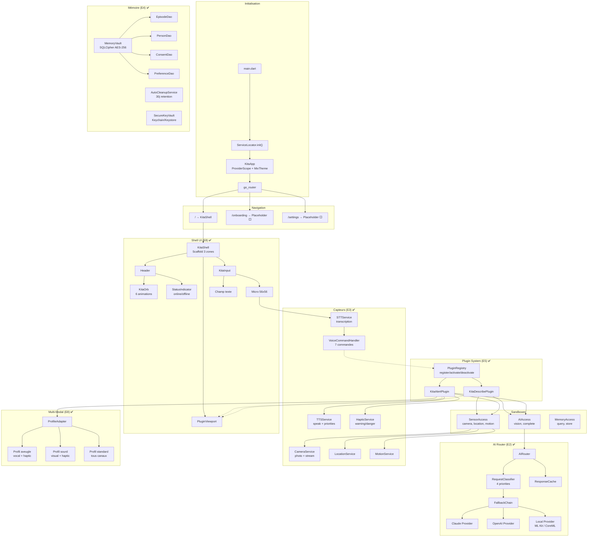
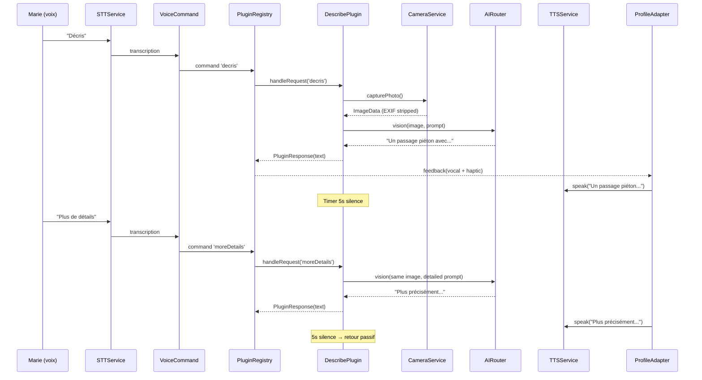
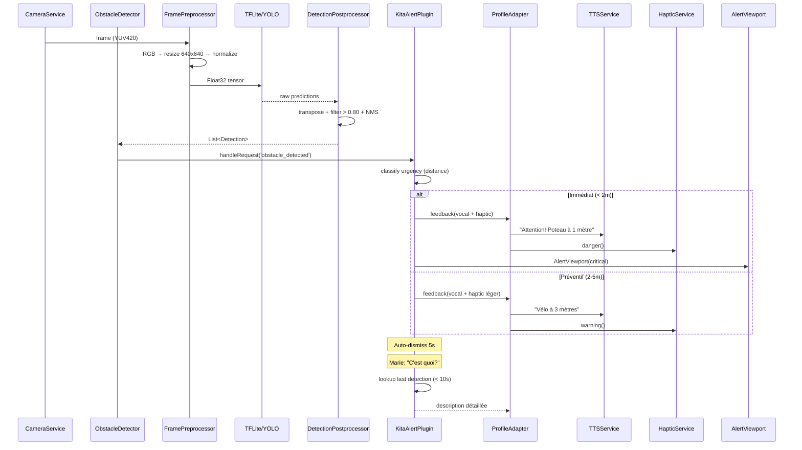

# Kita — Architecture actuelle (Phase 3)

## Vue d'ensemble

## Flow Describe (E6) ✅

## Flow Alert (E7) ✅

## État du câblage

| Composant | Code | Câblé | Phase |
|-----------|------|-------|-------|
| KitaShell (3 zones) | ✅ | ⚠️ partiel | E8 |
| KitaOrb (animations) | ✅ | ✅ | E8 |
| KitaInput (mic+texte) | ✅ | ⚠️ callbacks définis, pas branchés | E8 |
| PluginRegistry | ✅ | ✅ | E5 |
| Describe Plugin | ✅ | ✅ via sandboxes | E6 |
| Alert Plugin | ✅ | ✅ via sandboxes | E7 |
| AI Router + Fallback | ✅ | ⚠️ pas de provider Riverpod public | E2 |
| Camera/TTS/STT/Haptic | ✅ | ⚠️ services dispo, intégration Shell partielle | E3 |
| Memory (SQLCipher) | ✅ | ❌ infrastructure prête, pas utilisée | E4 |
| ProfileAdapter | ✅ | ✅ Alert l'utilise | E8 |
| Onboarding | ❌ placeholder | ❌ | E9 |
| Background service | ❌ pas commencé | ❌ | E10 |
| Settings/Forget | ❌ placeholder | ❌ | E10 |

## Ce qui manque pour le MVP

1. **Phase 4 — E9** : Onboarding vocal (Marie ouvre l'app pour la 1ère fois)
2. **Phase 4 — E10** : Background service (détection continue quand l'app est en arrière-plan)
3. **Phase 5 — E11** : Tests E2E, CI/CD, build signé, déploiement stores
4. **Câblage Shell ↔ Plugins** : KitaInput → VoiceCommand → PluginRegistry (partiellement fait)
5. **Câblage Shell ↔ AI** : Requêtes texte → AIRouter (pas encore fait)
6. **Memory utilisée** : Les plugins ne stockent pas encore d'épisodes en mémoire
